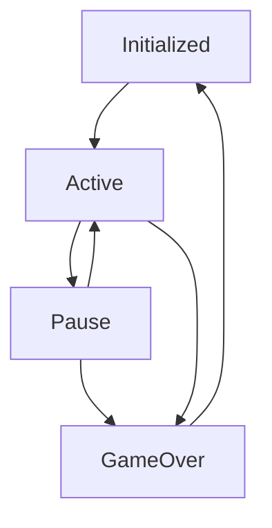

# GameZ

GameZ is a toolkit for building games in React. It provides a collection of reusable components, hooks, and utilities to streamline the game development process. The SDK also includes features like asset preloading, state management, and event handling.

## Game Lifecycle



- Initialized: Waiting to be started, assets loaded,
- Active: Game started
- Pause: Game Paused because of some event
- GameOver: Game completed because of success, error or timeout

### Installation
```
    npm i https://github.com/CREaiTORS/gamez
```

### Sample code

```typescript
import { GameService } from "gamez";

const levels = [
  { lives: 4, cards: 4, animals: 5 },
  { lives: 5, cards: 7, animals: 10 },
  { lives: 6, cards: 9, animals: 15 },
];

const assets = {
  bg: "/assets/bg.png",
  animals: "/assets/animals.mp4",
  cat: "/assets/cat.png",
  card: "/assets/card.png",
};

const gs = new GameService("my-game-name", levels, assets);

// you should wait for the assets to be loaded before starting
await gs.preloadAssets();

// using assets is simple
;
<video src={src.assets.animals} />;

// start the game session
gs.startSession();
// do your work

// if you need to pause the game
gs.pauseSession();
// to resume
gs.resumeSession();

// do your work
// call endSession to end the game session
// resultStatus = "success" | "error" | "timeout"
gs.endSession(resultStatus);
// after end session any updates will be rejected

// you can attach listeners for session end, listener will receive resultStatus as argument
gs.onSessionEnd((resultStatus) => {
  // do you work

  // you should call collectResult after en
  const result = await gs.collectResult();
  gs.resetSession();

  gs.nextLevel();
});

// once done with

// to get the result you need to first update result with your values
// you will have to add this function it will be called when collectResult is executed
gs.updateResult((oldResult) => ({ ...oldResult, somevalue: value }));
```
