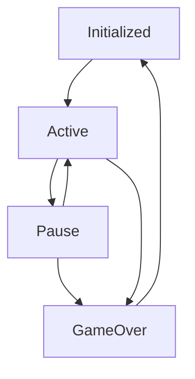

# GameZ

GameZ is a toolkit for building games in React. It provides a collection of reusable components, hooks, and utilities to streamline the game development process. The SDK also includes features like asset preloading, state management, and event handling.

## Game Lifecycle



- Initialized: Waiting to be started, assets loaded
- Active: Game running
- Pause: Game paused due to user interaction or system events
- GameOver: Game completed (success, failure, or timeout)

## Installation

```bash
npm install https://github.com/CREaiTORS/gamez.git
```

## Quick Start

```typescript
import { GameService } from "@creaitors/gamez";

// Define your game levels
const levels = [
  { lives: 3, timeLimit: 60, difficulty: "easy" },
  { lives: 2, timeLimit: 45, difficulty: "medium" },
  { lives: 1, timeLimit: 30, difficulty: "hard" },
];

// Define assets to preload
const assets = {
  backgroundImage: "/assets/background.png",
  playerSprite: "/assets/player.png",
  soundEffects: {
    success: "/assets/sounds/success.mp3",
    failure: "/assets/sounds/failure.mp3",
  },
};

// Initialize game service
const gs = new GameService("my-awesome-game", levels, assets);

// Usage example
async function startGame() {
  // Preload all assets before starting
  await gs.preloadAssets();

  // Start game session
  gs.startSession();

  // Access assets in your components
  const Background = () => ;

  // Game control methods
  function pauseGame() {
    gs.pauseSession();
  }

  function resumeGame() {
    gs.resumeSession();
  }

  // Handle game completion
  gs.addSessionEndListener((status) => {
    console.log(`Game ended with status: ${status}`);

    // Collect results for analytics or score tracking
    const results = gs.collectReport();

    // Move to next level
    if (status === "success") {
      gs.nextLevel();
    }
  });

  // Update game results
  gs.reportUpdater(() => ({
    score: 1250,
    timeElapsed: 45,
    attempts: 3,
  }));

  // End game with a status
  function completeLevel(success = true) {
    gs.endSession(success ? "success" : "failure");
  }
}
```

## Advanced Features

- **Level Management**: Easily define and navigate between game levels
- **State Management**: Track game state with built-in state management
- **Asset Preloading**: Ensure all assets are ready before gameplay begins
- **Event System**: Subscribe to game lifecycle events
- **Results Tracking**: Collect and process game results for analytics
- **Error Handling**: Comprehensive error boundaries and recovery mechanisms
- **Performance Optimization**: Efficient React hooks and memory management
- **TypeScript Support**: Full type safety with generic constraints

## Documentation

See the [docs](/docs) folder for comprehensive documentation:

- [Architecture Guide](/docs/ARCHITECTURE.md) - System design and architectural decisions
- [API Reference](/docs/API.md) - Complete API documentation with examples

## Development

```bash
# Run tests
npm test

# Build library
npm run build

# Development server
npm run dev
```
