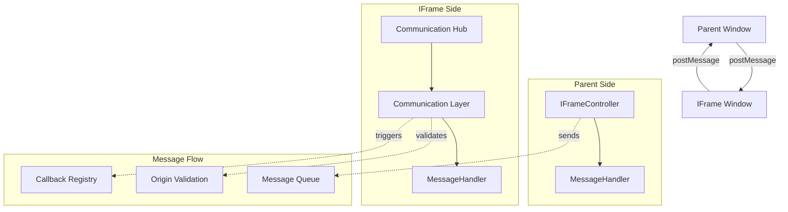

# Frame Relay Communication System

## Overview

The Frame Relay system provides secure, bi-directional communication between an iframe and its parent window. It implements a robust message-passing architecture with strict origin validation, automatic connection management, and type-safe event handling.

## Architecture



## Core Components

### IFrameController (Parent Side)

**Responsibility**: Manages iframe lifecycle and parent-to-child communication

**Key Features**:

- **State Management**: Tracks iframe initialization states (Bootstrapped → Loaded → Initialized)
- **Message Routing**: Type-safe message dispatch to iframe
- **Lifecycle Management**: Handles iframe creation, initialization, and termination
- **Game Control**: Provides high-level game control methods (start, stop, sync)

**State Machine**:

```
Bootstrapped → Loaded → Initialized
     ↓            ↓         ↓
   (iframe)   (script    (handshake
   created)   loaded)    complete)
```

### Communication Hub (IFrame Side)

**Responsibility**: Manages child-to-parent communication and message processing

**Key Features**:

- **Origin Validation**: Whitelist-based security for incoming messages
- **Message Queuing**: Buffers messages until parent relationship is established
- **Automatic Reconnection**: Handles parent window changes and closed connections
- **Callback Management**: Associates responses with original requests

### Message System

**Message Types**:

- `control`: System-level operations (init, navigation)
- `game`: Game-specific commands (start, stop, report)
- `sync`: State synchronization between parent and child
- `request`: Data requests requiring responses
- `error`: Error propagation and handling

**Message Structure**:

```typescript
type Message = {
  id?: string; // Unique identifier for request/response correlation
  type: MessageType; // Message category
  method?: string; // Specific action within the type
  text?: string; // Human-readable description
  payload?: unknown; // Typed data payload
};
```

## Security Model

### Origin Validation

The system implements a whitelist-based origin validation:

```typescript
const TRUSTED_ORIGINS = ["revitalaize.vercel.app", "localhost:3000", "revitalaize-games.netlify.app"];
```

**Validation Rules**:

1. Exact hostname matching
2. Wildcard subdomain support (\*.domain.com)
3. Port-specific validation for development
4. Automatic rejection of untrusted origins

### Message Integrity

- **JSON Validation**: All messages must be valid JSON
- **Type Checking**: Messages are validated against TypeScript interfaces
- **Source Verification**: Message source window is verified before processing
- **Callback Security**: Response callbacks are cleared after execution

## Performance Considerations

### Message Queuing

- **Deferred Delivery**: Messages are queued until parent relationship is established
- **Automatic Flushing**: Queue is processed when connection becomes available
- **Memory Management**: Callbacks are automatically cleaned up to prevent leaks

### Event Listener Management

- **Single Listener**: Uses a single message listener per window to minimize overhead
- **Efficient Routing**: Message types are routed using switch statements for O(1) dispatch
- **Cleanup**: Listeners are properly removed during teardown

## Error Handling Strategy

### Connection Failures

1. **Timeout Handling**: 30-second timeout for iframe initialization
2. **Parent Detection**: Automatic fallback between iframe.parent and window.opener
3. **Connection Recovery**: Handles closed parent windows and re-establishes connections

### Message Failures

1. **Malformed Messages**: Graceful handling of invalid JSON
2. **Unknown Types**: Fallback handler for unrecognized message types
3. **Origin Rejection**: Secure handling of messages from untrusted sources

### Development Aids

1. **Comprehensive Logging**: Detailed console output for debugging
2. **State Validation**: Assertions for invalid state transitions
3. **Type Safety**: Compile-time validation prevents many runtime errors

## Integration Patterns

### Game Service Integration

```typescript
// Setup frame relay with game service
const messageHandler = await setupFrameRelay(gameService);

// Handle game state synchronization
messageHandler.onSyncStateMessage = (message) => {
  if (message.method === SyncState.currLevel) {
    gameService.setCurrLevel(message.payload as number);
  }
};
```

### Custom Message Handling

```typescript
// Extend MessageHandler for custom behavior
class GameMessageHandler extends MessageHandler {
  onGameMessage(message: Message) {
    switch (message.method) {
      case GameMethod.start:
        this.startGame();
        break;
      case GameMethod.stop:
        this.stopGame();
        break;
    }
  }
}
```

## Best Practices

### Parent Window Implementation

1. **State Tracking**: Always track iframe state before sending messages
2. **Error Boundaries**: Wrap iframe operations in try-catch blocks
3. **Timeout Management**: Set reasonable timeouts for initialization
4. **Resource Cleanup**: Properly terminate iframe connections

### Child Window Implementation

1. **Early Initialization**: Call initializeCommunication() as early as possible
2. **Message Validation**: Always validate incoming message structure
3. **State Synchronization**: Keep child state in sync with parent
4. **Graceful Degradation**: Handle communication failures gracefully

### Security Considerations

1. **Origin Whitelisting**: Maintain strict origin validation
2. **Data Sanitization**: Validate and sanitize all incoming payloads
3. **Callback Cleanup**: Clear callbacks to prevent memory leaks
4. **Error Information**: Avoid exposing sensitive data in error messages

## Testing Strategy

### Unit Tests

- Message parsing and validation
- Origin validation logic
- State machine transitions
- Callback management

### Integration Tests

- Parent-child communication flow
- Error handling scenarios
- Timeout behavior
- Security validation

### End-to-End Tests

- Complete iframe lifecycle
- Game integration scenarios
- Network failure simulation
- Performance under load
